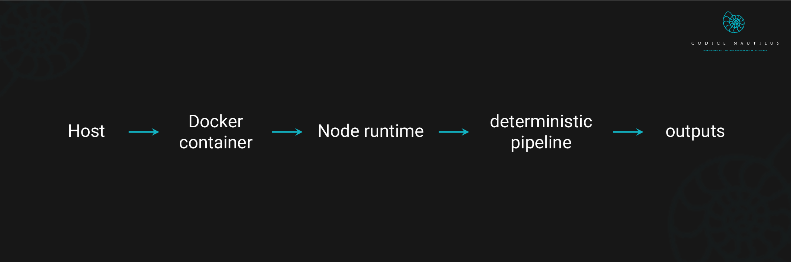

# 🚀 Quickstart — Prima Veritas OSS (Deterministic Pipeline)

<p align="center">
  
</p>

Run the fully deterministic Prima Veritas OSS pipeline using Docker.  
All outputs are **bit-for-bit identical** across all machines.

---

## 1. Build the Docker Image (Required)

From the repo root:

```powershell
docker build -t prima-veritas-oss -f Dockerfile .
```

This produces a sealed deterministic environment with:

- pinned Node 18.20.0  
- deterministic normalization  
- deterministic KMeans  
- zero nondeterministic dependencies  
- isolated filesystem reproducibility  

---

## 2. Run the Deterministic Pipeline

The container requires a bind-mount so outputs land in your repo under `datasets/`.

---

### **Mac / Linux**

#### Run Iris
```bash
docker run -it --rm \
  -v $(pwd)/datasets:/app/datasets \
  prima-veritas-oss iris
```

#### Run Wine
```bash
docker run -it --rm \
  -v $(pwd)/datasets:/app/datasets \
  prima-veritas-oss wine
```

---

### **Windows (PowerShell)**  
(✓ correct for Docker Desktop, ✓ `${PWD}` expansion, ✓ working line syntax)

#### Run Iris
```powershell
docker run -it --rm `
  -v ${PWD}\datasets:/app/datasets `
  prima-veritas-oss iris
```

#### Run Wine
```powershell
docker run -it --rm `
  -v ${PWD}\datasets:/app/datasets `
  prima-veritas-oss wine
```

---

## 3. Output Locations

Each deterministic run produces:

```
datasets/<dataset>/<dataset>_normalized.json
datasets/<dataset>/<dataset>_kmeans.json
```

Examples:

```
datasets/iris/iris_normalized.json
datasets/iris/iris_kmeans.json

datasets/wine/wine_normalized.json
datasets/wine/wine_kmeans.json
```

The pipeline also updates:

```
reports/FITGEN_RUNTIME_DIGEST.json
```

Built using:

```
tools/fitgen_runtime_digest_builder.mjs
```

It merges digest files from:

```
reports/digests/
```

---

## 4. Determinism Guarantee

These commands:

```
docker run --rm prima-veritas-oss iris
docker run --rm prima-veritas-oss wine
```

must produce outputs matching the **v0.1.0 golden hashes**.

To verify:

```bash
node tools/hashcheck.mjs iris
node tools/hashcheck.mjs wine
```

Correct execution prints:

```
normalized → ✔ MATCH
kmeans     → ✔ MATCH
```

Your environment is now:

- reproducible  
- sealed  
- deterministic  
- fully aligned with Prima Veritas OSS v0.1.0  

---

## Need the full deterministic pipeline?
Complete architecture, module list, and diagrams:  
➡ **README.md**
