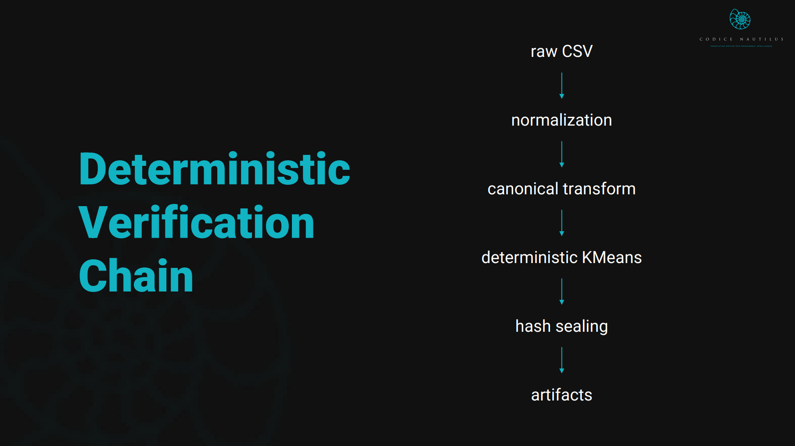

<p align="center">
  
</p>

---

# ⭐ Prima Veritas OSS — Deterministic Analytics Benchmark (v0.1.1)

**prima_veritas_oss** — Bit-for-Bit Deterministic Analytics

<p align="left">
  
  
  
  
</p>

# ⭐ Prima Veritas OSS — Deterministic Analytics Benchmark (v0.1.0)

**prima_veritas_oss** is a sealed, bit-for-bit deterministic analytics pipeline.

It provides a canonical reference implementation of reproducible verification:

```
ingest → normalize → canonicalize → deterministic KMeans → hash-sealed outputs
```

Every run — on any machine, any OS, any hardware — produces **identical bits**.

This repository is the official “Hello World” for reproducible analytics:  
lightweight, transparent, research-friendly, and MIT-licensed.

---

## 👤 Maintainer
**Bryan Ziehl**  
📧 primaveritas.oss@proton.me  
Maintainer photo: `assets/maintainers/bryan_ziehl_profile_fullres.jpg`

---

## ❓ Why Determinism Matters

Reproducibility failures plague science, ML, and enterprise analytics.  
Two machines can run the *same code* and still diverge due to:

- nondeterministic libraries  
- floating-point drift  
- locale / timezone differences  
- hidden randomness  
- environment-specific behavior  

**Prima Veritas OSS eliminates these failure modes** using a fully canonical, sealed pipeline.

This enables:

- verifiable research  
- cross-machine audits  
- tamper-resistant data processing  
- optional future on-chain anchoring  

---

## 🧱 Architecture Overview

<p align="center">
  
</p>

Full pipeline diagrams, module maps, and determinism chain:

➡ **ARCHITECTURE.md**

---

## 🐳 Deterministic Execution Environment

Prima Veritas OSS ships with a **fully reproducible Docker environment**.

**Pinned Base Image:**  
`node:18.20.0-slim`

**Guarantees:**

- zero nondeterministic dependencies  
- isolated filesystem  
- controlled numeric behavior  
- canonical sort orders  
- sealed execution 

<p align="center">
  
</p> 

**Recommended:** run everything via Docker  
**Native:** supported, but bit-for-bit equivalence is not guaranteed.

---

## 🔧 Deterministic Normalization Rules

Prima Veritas enforces strict canonicalization:

- column names sorted lexicographically  
- row order preserved  
- numeric strings → numbers  
- empty / undefined → `null`  
- no randomness  
- no timestamps  
- no locale drift  
- zero nondeterministic behavior  

CSV files with identical numeric values — even with different column order — normalize to the **exact same JSON**.

---

## 🧪 Deterministic Test Suite (One Command)

Run all verification tests:

```bash
node tests/run_tests.mjs
```

This suite verifies:

### ✔ Golden Hash Matching  
Normalized + KMeans outputs must match the official v0.1.0 golden hashes.

### ✔ Normalization Stability  
Two runs → byte-for-byte identical JSON.

### ✔ KMeans Stability  
Centroids + assignments deterministic across runs.

### ✔ Cross-Machine Equivalence  
Validated on **Laptop A**, **Laptop B**, and **Docker**.

If this suite passes, your environment matches the canonical release.

---

## 📊 Validation Results (v0.1.0)

Validated across two physical machines using the official Docker image.

| Dataset | File                | SHA-256 Hash                                                         | Match |
|--------|---------------------|-----------------------------------------------------------------------|-------|
| iris   | iris_kmeans.json    | `DA96D0505BCB1A5A2B826CEB1AA7C34073CB88CB29AE1236006FA4B0F0D74C46`   | ✔     |
| wine   | wine_kmeans.json    | `8A0B046DD9813282FC108DDA0EA94A0D18F7E7B9E9910A74D8FFBC13EDB6B921`   | ✔     |

Confirms:

- deterministic outputs  
- deterministic normalization  
- fixed-point KMeans  
- sealed Docker environment  

---

## 🟣 Golden Hashes — v0.1.0 (Canonical)

Correct executions **must** reproduce these exactly.

### **Iris Dataset**
```
iris_normalized.json → EF28EA082C882A3F9379A57E05C929D76E98899E151A6746B07D8D899644372F
iris_kmeans.json     → DA96D0505BCB1A5A2B826CEB1AA7C34073CB88CB29AE1236006FA4B0F0D74C46
```

### **Wine Dataset**
```
wine_normalized.json → D4F52AAA1D5F294A3F647DF3198E765D619099888140C96E582663968DCE5756
wine_kmeans.json     → 8A0B046DD9813282FC108DDA0EA94A0D18F7E7B9E9910A74D8FFBC13EDB6B921
```

---

## 🎯 Deterministic Centroids (v0.1.0)

Correct centroids must be reproduced exactly.

### Iris Centroids (k=3, dim=4)
```json
[
  [1.464, 0.244, 5.006, 3.418],
  [4.388524590164, 1.434426229508, 5.883606557377, 2.740983606557],
  [5.715384615385, 2.053846153846, 6.853846153846, 3.076923076923]
]
```

### Wine Centroids (k=3, dim=12)
```json
[
  [2.312692692696, 1.5, 3.84362692693, 1.812692692696, 2.490730730737, 2.205185185185, 18.26111111111, 12.96666666667, 2.529074074074, 1.158148148148, 3.001481481481, 93.240740740741],
  [2.356116504854, 2.320388349515, 2.795048543689, 1.704368932039, 3.407184456311, 9.799417475728, 17.981650485437, 10.230388349515, null, null, null, null],
  [2.546666666667, 1.190476190476, 1.762857142857, 1.87380952381, 2.821904761905, 5.314285714286, 18.77619047619, 13.563333333333, 2.87619047619, 1.137142857143, 3.076666666667, 120.761904761905]
]
```

---

## 🔍 Hashcheck Utility

Verify outputs manually:

```bash
node tools/hashcheck.mjs iris
node tools/hashcheck.mjs wine
```

Example:
```
=== Prima Veritas OSS — Hash Check (iris) ===
normalized → ✔ MATCH
kmeans     → ✔ MATCH
```

Confirms:

- deterministic outputs  
- correct execution  
- no environment drift  

---

## 🧾 Versioning

This project follows **Semantic Versioning**.  
Full release policy:

➡ **RELEASE_TAGS.md**

---

## 🛣 Roadmap

### [Unreleased]
- Deterministic PCA  
- Deterministic HCLUST  
- Additional datasets  
- Extended verification utilities  
- Monthly / 45-day release cadence  
- Expanded reproducibility docs  

### v0.1.0 — Initial Release
- deterministic ingest + normalization  
- deterministic KMeans (Iris + Wine)  
- fully Dockerized reproducible environment  
- MIT License  

---

### 👉 **Running the Pipeline**
For full, copy-paste-ready commands:  
➡ **QUICKSTART.md**